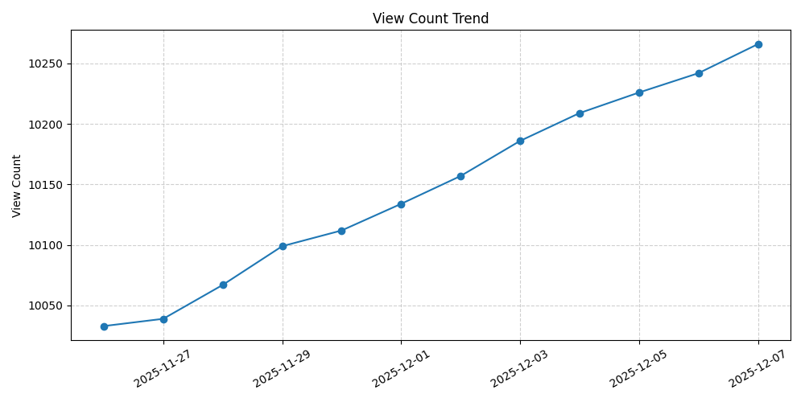
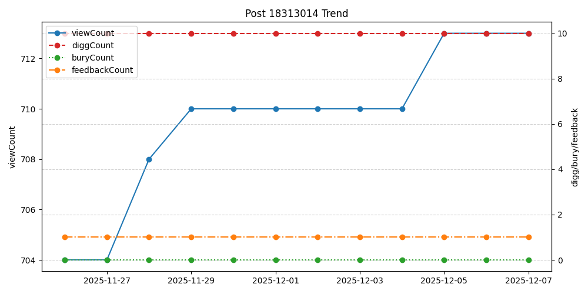
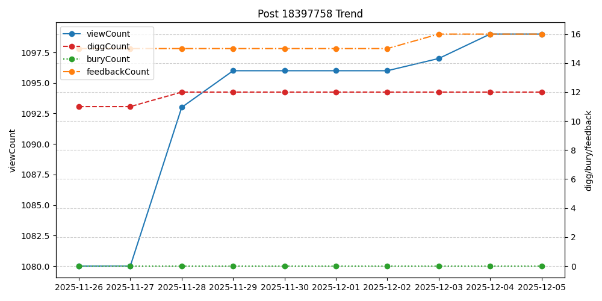

# cnblogs-recorder
a recorder for my blog in https://www.cnblogs.com/XuYueming

this project is licensed under the MIT License - see the [LICENSE](LICENSE) file for details.

for more info, please see [my blog](https://www.cnblogs.com/XuYueming/p/19274737).

------

blog total view count:

statistics of [圆方树学习笔记 —— 一种关于点双连通分量的思考方式](https://www.cnblogs.com/XuYueming/p/18313014):

statistics of [二项式反演学习笔记](https://www.cnblogs.com/XuYueming/p/18397758):

